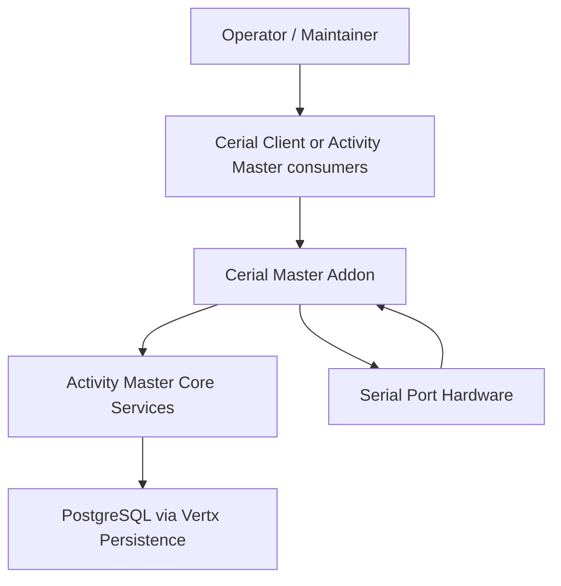

# C4 Level 1 — Context

Cerial Master is an Activity Master addon that registers and manages serial port connections and classifications. It sits beside Activity Master core services and persists configuration through the FSDM resource/classification APIs while reading available ports from the host OS.

Evidence
- Service implementation: `src/main/java/com/guicedee/activitymaster/cerialmaster/CerialMasterService.java`
- Guice/JPMS wiring: `src/main/java/module-info.java`, `CerialMasterModule`, `CerialMasterSystem`, `CerialMasterInstall`
- Serial port discovery: jSerialComm usage in `CerialMasterService.listComPorts`
