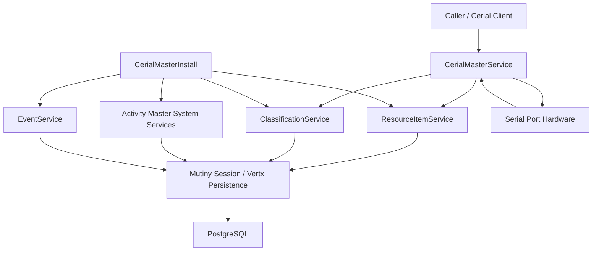

# Data Flow and Trust Boundaries — Cerial Master

Trust boundaries
- Hardware boundary: Serial port scanning uses jSerialComm; treat device input as untrusted. Validation/logging occurs in `CerialMasterService`.
- Persistence boundary: Mutiny/Hibernate Reactive sessions wrap all writes; identity tokens from Activity Master (`getISystemToken`) guard access.
- Dependency boundary: Activity Master services (resource, classification, events, systems) control authorization and schema; this module should not bypass them.

Dependency map
- Activity Master Core/Client: system discovery, tokens, resource/classification/events services.
- GuicedEE Vert.x Persistence: Mutiny sessions and database connectivity.
- jSerialComm / nrjavaserial: hardware enumeration and COM port handling.
- Cerial Master Client: provides `ComPortConnection` domain projection and timed sender helpers.
