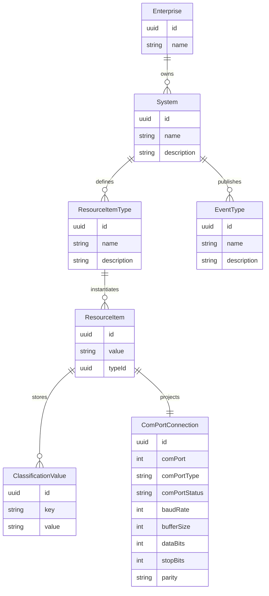

# ERD — Serial Connection Model

Mapping to code
- Enumerations defining classification keys and resource item types: `services/enumerations/*`.
- Resource item and classification creation flows: `CerialMasterInstall`, `CerialMasterService.addOrUpdateConnection`.
- Event types created during installation: `CerialMasterInstall` (RegisteredANewConnection, ClosedANewConnection, message events).
- ComPortConnection domain projection: `com.guicedee.activitymaster.cerialmaster.client.ComPortConnection` populated in `CerialMasterService.findComPortConnection`.
