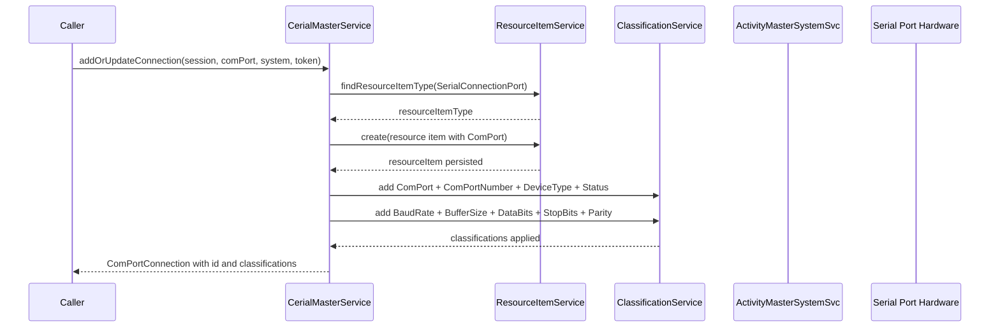

# Sequence — Add or Update COM Port

Flow traced from `CerialMasterService.addOrUpdateConnection` using a provided Mutiny session and Activity Master system token.

Notes
- Failure handling is logged via Log4j2; invalid comPort inputs short-circuit with UnsupportedOperationException.
- Hardware enumeration is implicit: com port identity comes from `ComPortConnection` supplied by caller (created via jSerialComm discovery).
- All persistence is executed with the provided Mutiny session to share a transaction boundary with upstream workflows.
