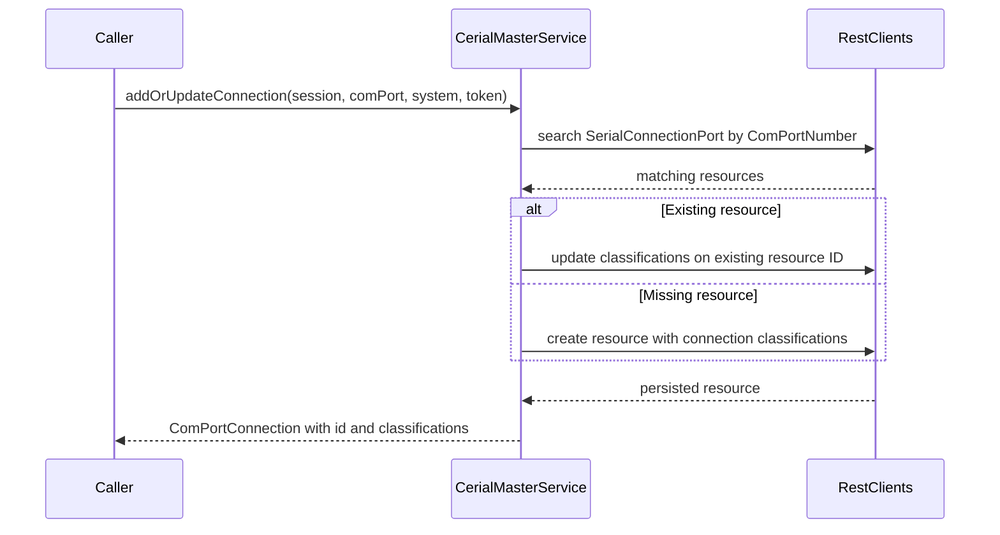

# Sequence — Add or Update COM Port

`CerialMasterService.addOrUpdateConnection` accepts a `Mutiny.StatelessSession`, but persists through `RestClients` under the requesting system name. The warehouse REST boundary resolves its own session and security context.

```mermaid
sequenceDiagram
  participant Caller
  participant Service as CerialMasterService
  participant REST as RestClients

  Caller->>Service: addOrUpdateConnection(session, comPort, system, token)
  Service->>REST: search SerialConnectionPort by ComPortNumber
  REST-->>Service: matching resources
  alt Existing resource
    Service->>REST: update classifications on existing resource ID
  else Missing resource
    Service->>REST: create resource with connection classifications
  end
  REST-->>Service: persisted resource
  Service-->>Caller: ComPortConnection with id and classifications
```

Notes
- Failure handling is logged via Log4j2; invalid comPort inputs short-circuit with UnsupportedOperationException.
- Hardware enumeration is implicit: com port identity comes from `ComPortConnection` supplied by caller (created via jSerialComm discovery).
- The stateless method owns the REST implementation directly; it must not delegate to itself with a null session. Lookup, status updates and registered-port listing follow the same direct REST pattern.
- Lookup hydrates serial settings and silently applies persisted status; missing resources fail with `NoSuchElementException`.
- Status updates change only the status classification; a missing resource returns the supplied connection without a write.
- REST failures propagate. These calls do not share the caller's database transaction or open serial hardware.
