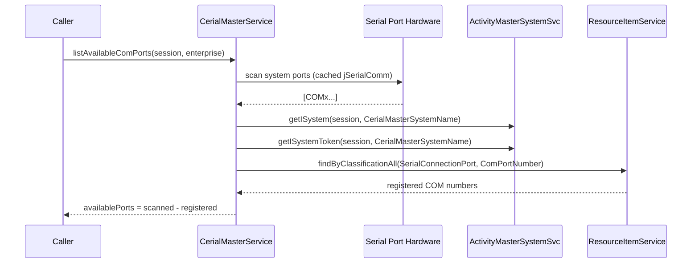

# Sequence — List Available COM Ports

Flow traced from `CerialMasterService.listAvailableComPorts`.

Notes
- Hardware scan caches results in-memory (`comStrings` list) until process restart.
- Registered ports are derived from Activity Master resource items classified with `SerialConnectionPort` and `ComPortNumber`.
- All lookups use the caller-provided Mutiny session to stay within the same transaction.
