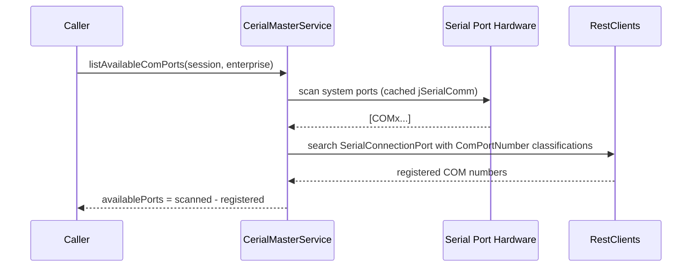

# Sequence — List Available COM Ports

Flow traced from `CerialMasterService.listAvailableComPorts`.

```mermaid
sequenceDiagram
  participant Caller
  participant Service as CerialMasterService
  participant SerialPorts as Serial Port Hardware
  participant REST as RestClients

  Caller->>Service: listAvailableComPorts(session, enterprise)
  Service->>SerialPorts: scan system ports (cached jSerialComm)
  SerialPorts-->>Service: [COMx...]
  Service->>REST: search SerialConnectionPort with ComPortNumber classifications
  REST-->>Service: registered COM numbers
  Service-->>Caller: availablePorts = scanned - registered
```

Notes
- Hardware scan caches results in-memory (`comStrings` list) until process restart.
- Registered ports are derived from Activity Master resource items classified with `SerialConnectionPort` and `ComPortNumber`.
- Registered-port lookup calls REST directly under CerialMasterSystemName; REST resolves its own session and security context. The stateless method must not call itself with a null session.
